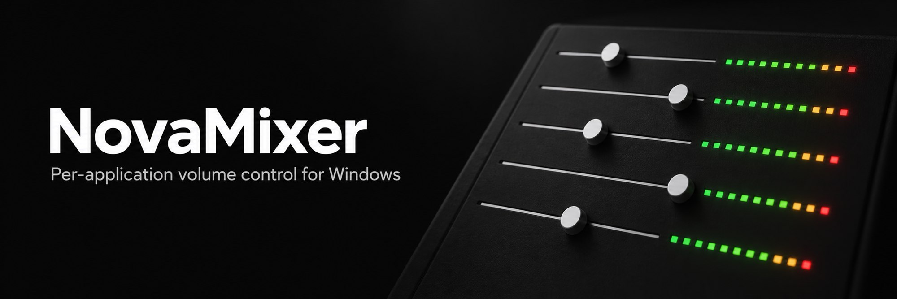
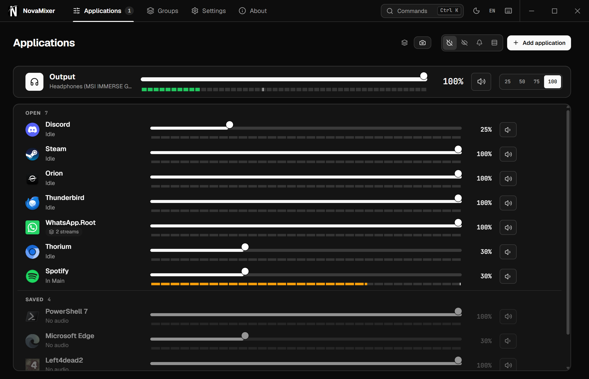
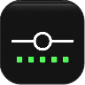
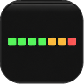
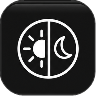
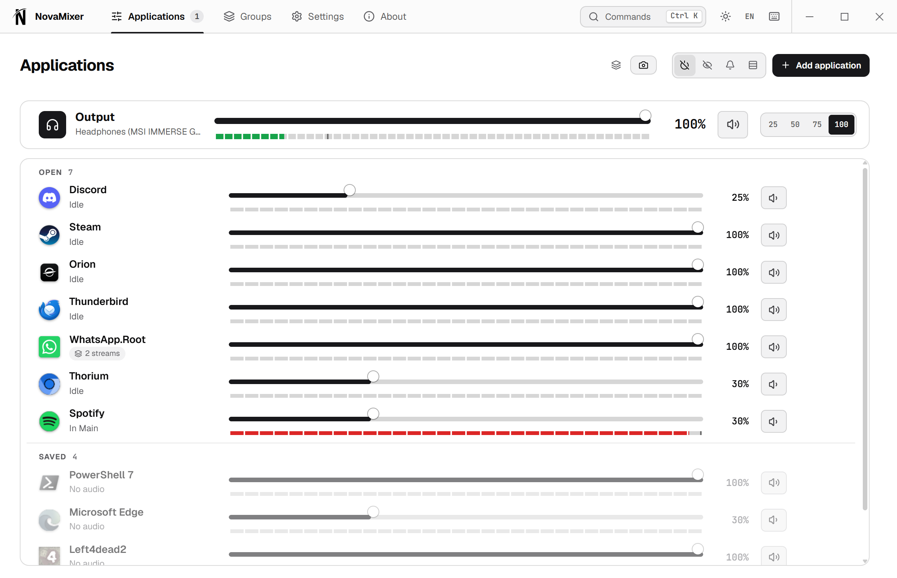
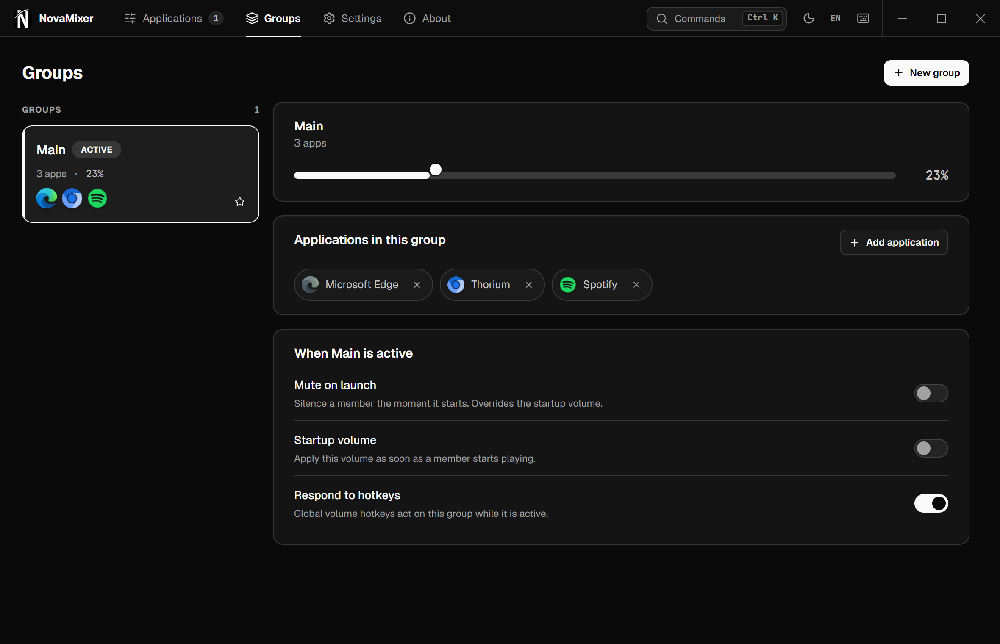
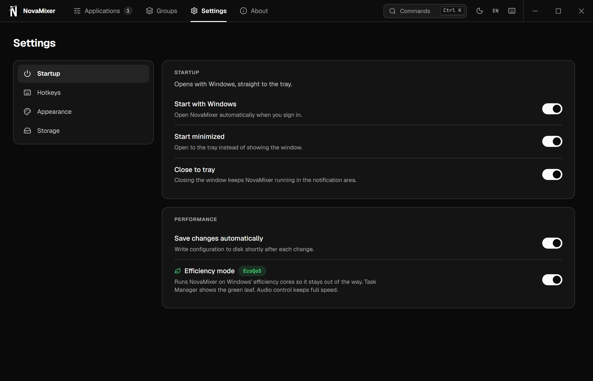
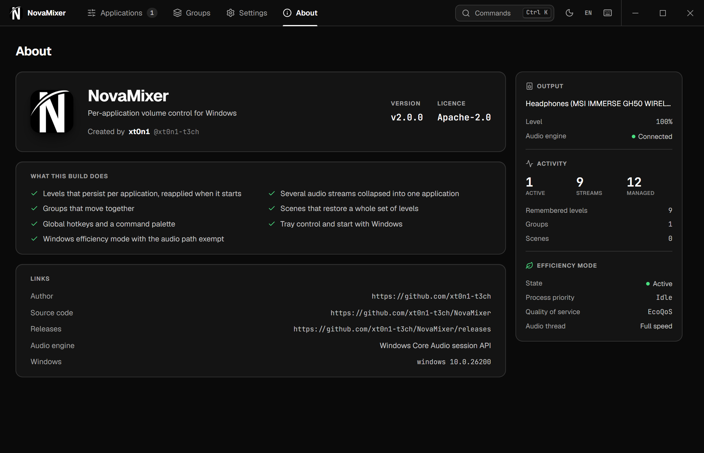

<div align="center">



<br />

[](#install)
[](CHANGELOG.md)
[](LICENSE)

[](https://tauri.app)
[](https://www.rust-lang.org)
[](https://svelte.dev)


**NovaMixer** is a free, open-source volume mixer for Windows. It gives every application its own
fader and a live level meter, remembers each level, and applies it again every time the application
opens. It is a faster, clearer replacement for the Windows volume mixer.

[Install](#install) · [Features](#features) · [Screenshots](#screenshots) · [Build from source](#build-from-source) · [Docs](docs/index.md)

</div>

---



## Features

| | Feature | What it does |
|:---:|:---|:---|
|  | **One fader per application** | Windows splits an application into several audio sessions. NovaMixer folds them into one row, so Discord appears once. Every fader stands in the same column. |
|  | **Levels that stay set** | Set a level once. NovaMixer applies it again whenever the application opens a new session, even after a restart or an update. |
|  | **Real meters, real time** | Each meter is the Windows peak level of that application, read every 50 ms. Fader changes reach Windows in about 5 ms. Nothing is simulated. |
|  | **Honest status** | Each row shows what Windows reports: **Active**, **Idle** (a session with no sound), **Locked** (Windows refuses the change), or **No audio**. |
|  | **Real application icons** | Icons come from the Windows shell at 128 px, including packaged Microsoft Store apps. |
|  | **Groups and scenes** | A group moves several applications together and can set a startup volume. A scene saves every level and restores it in one click. |
|  | **Keyboard first** | `Ctrl K` opens a command palette that finds any application or action. Global hotkeys control the active group or the output. |
|  | **Efficiency mode** | NovaMixer runs on the Windows efficiency cores and shows the green leaf in Task Manager. The audio thread keeps full speed. Idle CPU is well under 1% of one core. |
|  | **Stays out of the way** | Tray icon, start with Windows, close to tray, light and dark themes, English and Spanish. No network access during normal use. |

## Screenshots

<table>
  <tr>
    <td width="50%"></td>
    <td width="50%"></td>
  </tr>
  <tr>
    <td align="center"><sub><b>Light theme</b> — the same mixer, redrawn for daylight</sub></td>
    <td align="center"><sub><b>Groups</b> — one volume for several applications</sub></td>
  </tr>
  <tr>
    <td width="50%"></td>
    <td width="50%"></td>
  </tr>
  <tr>
    <td align="center"><sub><b>Settings</b> — startup, hotkeys, appearance, storage</sub></td>
    <td align="center"><sub><b>About</b> — version, author, and live engine status</sub></td>
  </tr>
</table>

<sub>Every screenshot is the installed app on a real Windows 11 machine, with real applications and real meter levels.</sub>

## Install

1. Download `NovaMixer_2.0.0_x64-setup.exe` from [Releases](https://github.com/xt0n1-t3ch/Nova-Mixer/releases).
2. Run it. The installer is per user and does not need administrator rights.
3. Open NovaMixer from the Start menu. It appears in the tray and can start with Windows.

An MSI package is also available for managed installs.

**Requirements:** Windows 10 or 11 (64-bit) and the Microsoft Edge WebView2 runtime, which Windows 11
already includes. The installer downloads WebView2 if it is missing.

## Build from source

You need Node.js 22, pnpm 9 through `corepack`, the stable Rust toolchain, and the
[Tauri prerequisites](https://tauri.app/start/prerequisites/).

```powershell
git clone https://github.com/xt0n1-t3ch/Nova-Mixer.git
cd Nova-Mixer
corepack pnpm install
corepack pnpm build
```

The build writes both installers under `target/release/bundle/`:

| Installer | Path | Scope |
|:---|:---|:---|
| NSIS | `nsis/NovaMixer_2.0.0_x64-setup.exe` | Current user, no administrator rights |
| MSI | `msi/NovaMixer_2.0.0_x64_en-US.msi` | Windows Installer package |

## Develop

| Task | Command |
|:---|:---|
| Run the app with hot reload | `corepack pnpm dev` |
| Open the design preview in a browser | `corepack pnpm --filter novamixer-frontend dev`, then `http://localhost:1420/preview.html` |
| Run every test | `corepack pnpm --filter novamixer-frontend test` and `cargo test --workspace` |
| Run the six validators | See [`CONTRIBUTING.md`](CONTRIBUTING.md) |
| Check efficiency mode on a live process | `pwsh scripts/check-efficiency.ps1` |
| Print the real meter readings | `cargo run -p novamixer-cli -- doctor --watch --peaks` |
| Capture README screenshots from the running app | `node scripts/capture-showcase.mjs` |

## How it works

NovaMixer is a [Tauri 2](https://tauri.app) desktop app. A Rust backend owns every Windows audio
call; a Svelte 5 interface draws the mixer.

| Path | Owns |
|:---|:---|
| [`crates/audio-sessions`](crates/audio-sessions) | The Windows Core Audio worker: sessions, change callbacks, metering, output devices |
| [`crates/app-icons`](crates/app-icons) | High-resolution shell icons and process metadata |
| [`crates/novamixer-application`](crates/novamixer-application) | Applications, groups, scenes, and settings writes |
| [`crates/settings-store`](crates/settings-store) | The versioned settings file, its backup, and migrations |
| [`src-tauri`](src-tauri) | Desktop shell, command registry, tray, hotkeys, efficiency mode |
| [`frontend`](frontend) | The Svelte 5 interface and its design preview |
| [`contracts/ipc.md`](contracts/ipc.md) | Every command, event, and wire type between the two |

Read [`docs/index.md`](docs/index.md) for the architecture and design notes, and
[`tests/index.md`](tests/index.md) for every test suite.

## Contribute

Issues and pull requests are welcome. Read [`CONTRIBUTING.md`](CONTRIBUTING.md), use
[Conventional Commits](https://www.conventionalcommits.org/), and run the six validators before you
open a pull request.

## Author

**NovaMixer** is designed and built by **[xt0n1](https://github.com/xt0n1-t3ch)**.

## License

[Apache-2.0](LICENSE) © xt0n1
